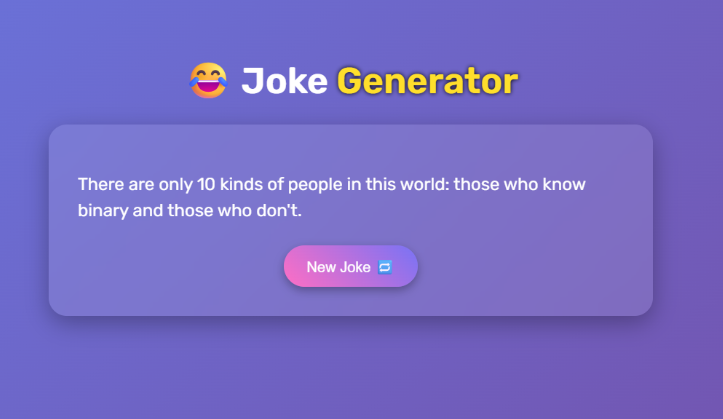

# 😂 Joke Generator 🤖  



A fun and light-hearted web application that delivers random programming jokes using the JokeAPI. Clean UI, refreshing experience, and developer-friendly humor — all in one click!

## Table of Contents
- [Features](#features)
- [Installation](#installation)
- [Usage](#usage)
- [API Used](#api-used)
- [Tech Stack](#tech-stack)
- [Project Structure](#project-structure)
- [Website Link](#website-link)

## Features

- 🎭 **Random Joke Generator**:
  - Fetches a new random programming joke on every click
  - Uses `type=single` jokes for clean one-liners

- 🎨 **Modern UI**:
  - Smooth gradients and glassmorphism design
  - Responsive layout optimized for all screen sizes

- 🧠 **Session Memory**:
  - Handles API errors gracefully

## Installation

1. Clone the repository:
   ```bash
   git clone https://github.com/asmath-akbar-ali/joke-generator.git

2. Navigate to the project folder:
   ```bash
   cd joke-generator
   ```
   
   Open the file index.html in your browser.

## Usage

- Open the app in your browser.

- Click the New Joke 🔁 button to get a fresh programming joke.

- Enjoy! Repeat whenever you need a smile 😄

## API Used

- JokeAPI by Sv443
- URL: https://jokeapi.dev
- Endpoint used: https://v2.jokeapi.dev/joke/Programming?type=single

## Tech Stack

✅ HTML5

✅ CSS3

✅ JavaScript (ES6)

## Project Structure

```bash

Joke-Generator/
├── index.html              
├── style.css               
├── script.js               
├── images/
│   └── joke-screenshot.png
```

## Website Link
  ```bash
  https://aaa-joke-generator.vercel.app/
